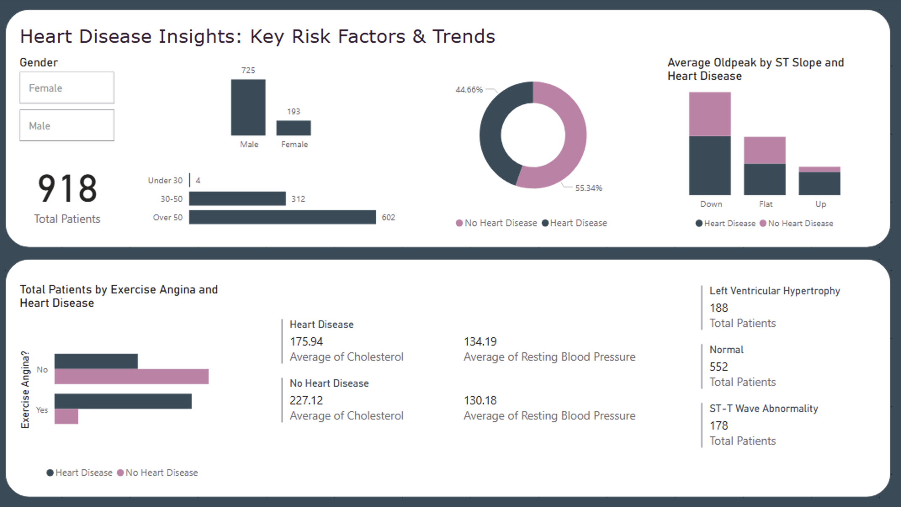

# Heart Disease Analysis Dashboard

## 📌 Project Description

This project presents an interactive **Power BI dashboard** that analyzes key risk factors associated with heart disease. The dashboard visualizes critical relationships between variables such as **cholesterol, blood pressure, ST slope, exercise-induced angina, and heart disease presence**, helping to uncover potential patterns and insights.

## 📊 Features

- **Cholesterol vs. Blood Pressure Analysis:** Understand how cholesterol and resting blood pressure relate to heart disease.
- **Exercise-Induced Angina vs. Heart Disease:** Identify how exercise-related angina correlates with heart disease prevalence.
- **ST Slope and Oldpeak Trends:** Examine ECG readings and their relationship with heart health.
- **Interactive Visualizations:** Filter data dynamically for in-depth exploration.

## 🖼 Screenshot



## 🗂 Dataset

The dataset used in this analysis includes clinical data points such as:

- **Age, Sex, and Resting Blood Pressure (RestingBP)**
- **Cholesterol Levels**
- **ST Slope and Oldpeak** (Depression induced by exercise relative to rest)
- **Exercise Angina (ExerciseInducedAngina)**
- **Heart Disease Presence (HeartDisease)**

## 🛠 Tools & Technologies

- **Power BI** for data visualization and interactive dashboard creation.
- **Excel / CSV** for data preparation and cleaning.
- **GitHub** for version control and project sharing.

## 📥 How to Use

1. **Clone this repository**:
   ```bash
   git clone https://github.com/yasmin-gab/heart-disease-analysis.git

